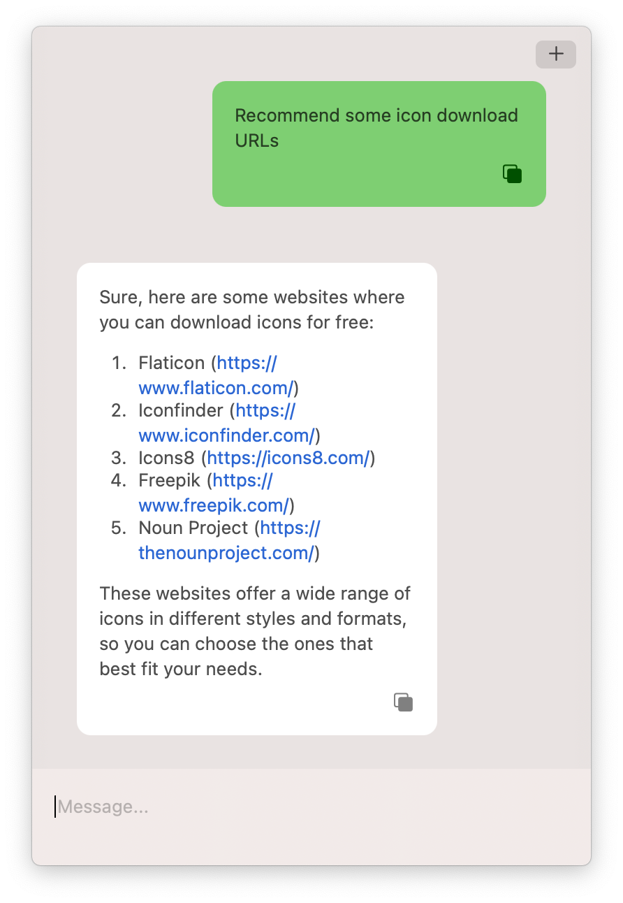
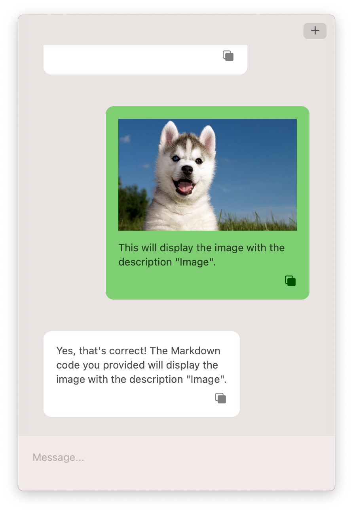

  

## Notice: This project is deprecated

This project is no longer actively maintained and supported. Please consider using our new app, [ChatTab](https://chattab.app).

ChatTab is a brand new native mac software for ChatGPT

* Unique UI Design

* iCloud

* Better Markdown Experience

* Better compatibility: macOS 11 +

* Live in menubar

* Displayed by shortcut keys, similar to Spotlight

* Custom Prompt

Learn more at [https://chattab.app](https://chattab.app)

# MacChatGPT

  

 MacOS menu bar app for ChatGPT.

## Build requirments

* Xcode 14.0

* MacOS 13.0

## Download

Go to [Release Page](https://github.com/LeaderBoy/Chat/releases)

## Usage

Just add your own API Key in app

## Dependency

[Super Coder](https://supercoder.lessimore.cn/) for generate Swift code and localization using ChatGPT's translation.

[Splash](https://github.com/JohnSundell/Splash) for code highlighting

[swift-markdown-ui](https://github.com/gonzalezreal/swift-markdown-ui.git) for Markdown

[AlertToast](https://github.com/elai950/AlertToast.git) for toast

[SDWebImageSwiftUI](https://github.com/SDWebImage/SDWebImageSwiftUI) for markdown image download and cache

## Screenshot

## Features

* Display dialogue content through markdown
* Support for continuous dialogue
* Clear history
* Custom API URL 

## Contributing

We are more than happy to accept external contributions to the project in the form of feedback, bug reports and even better - pull requests

## License

MacChatGPT is available under the MIT license. See the LICENSE file for more info.

计算如下表格的密度平均值、标准差、和显著水平

| 处理 | 密度 |
| 1 | 45 |
| 2 | 52.5 |
| 3 | 60 |
| 4 | 67.5 |

